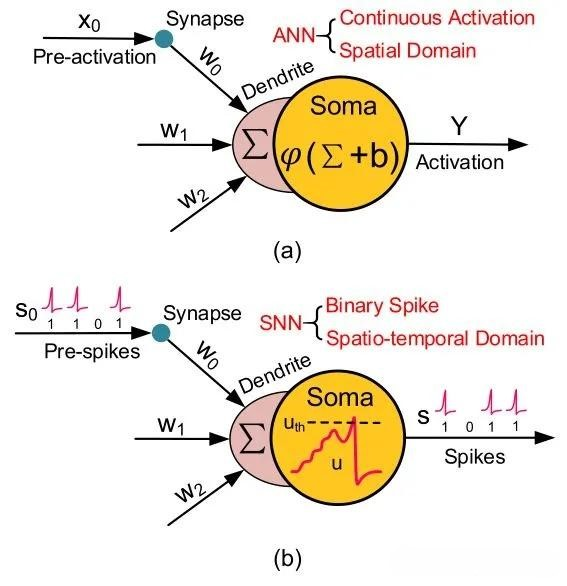
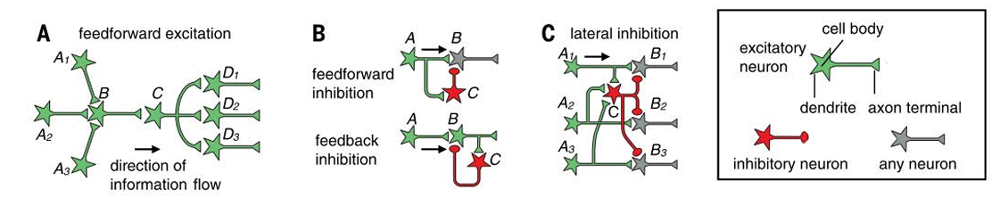
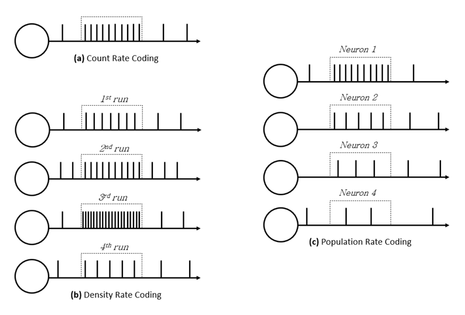
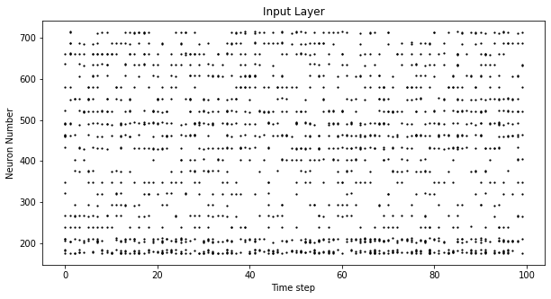
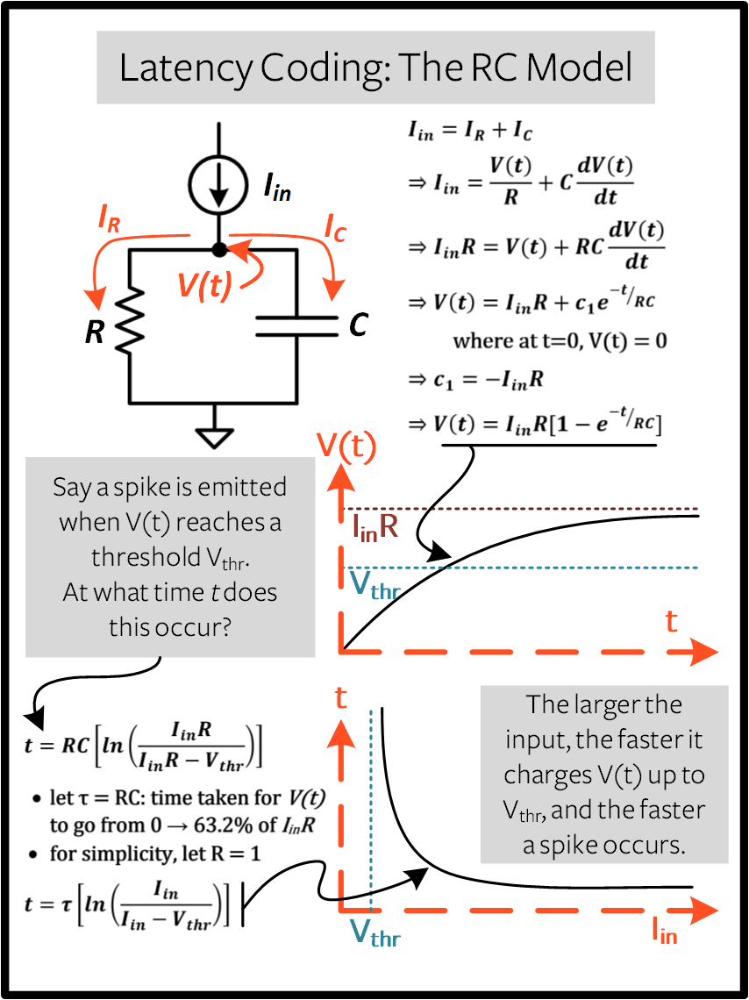
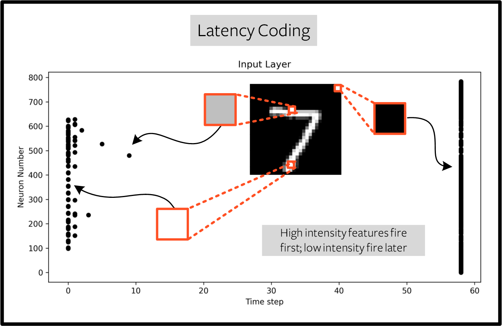
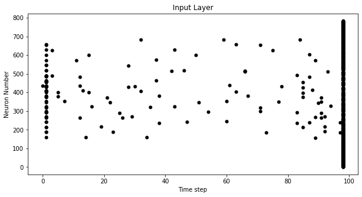
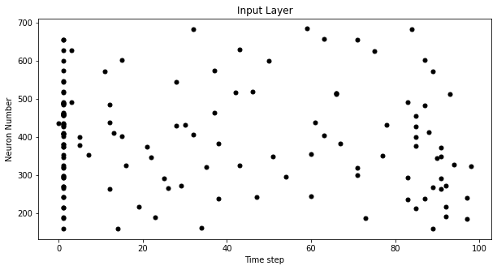

# SNN笔记

## SNN基础

### 提出背景[^1]

#### 生物神经元工作机制的模仿

- **生物神经元的工作机制** ：模拟生物大脑中的神经元以离散的脉冲形式传递信息，即当神经元的膜电位累积到一定阈值时产生动作电位或静息电位，这种脉冲通信方式具有稀疏性和事件驱动的特点。
  > **稀疏性**是由于神经元脉冲发放具有条件性，有对应的阈值机制，使得其不一直处于活跃状态；不仅稀疏向量/张量（包含大量零）易于存储，而且假设我们需要将稀疏激活值与突触权重相乘。如果大多数值与“0”相乘，那么我们就不需要从内存中读取许多网络参数。这意味着神经形态硬件可以非常高效。
    **事件驱动性**指神经元脉冲是动态的，只有触发对应的事件才会发放脉冲。
- **对大脑信息处理机制的借鉴** ：大脑在处理信息时展现出强大的效率和能力，SNN试图模仿大脑这种高效的信息处理机制，以实现更节能的计算。

#### 克服传统人工神经网络的局限性

- **ANN的计算与能耗问题** ：随着深度学习的发展，ANN的模型参数量和复杂性不断增加，导致计算资源消耗巨大，训练和推理时间大幅延长，且在硬件实现上面临功耗过高的挑战。
- **ANN的生物合理性不足** ：ANN在发展过程中逐渐偏离了生物神经网络的基础，无法对大脑的工作原理做出合理解释，限制了其在更广泛的生物模拟和认知科学领域的应用。
  > 个人的感受就是ANN更像是统计学习的升级版本，尽管ANN和SNN本质上都是在想尽力通过样本去拟合一个概率分布，但ANN数据的传输比较“机器”，SNN的生物合理性更强。

#### 神经科学和计算神经科学的发展推动

- **神经元模型的建立与完善** ：20世纪中期，Hodgkin和Huxley对鱿鱼神经元信号传导机制的研究，提出了描述神经元膜电位变化的Hodgkin-Huxley模型，为神经元的数学建模奠定了基础，尽管该模型模拟复杂，但为后续研究提供了重要参考。
- **对神经系统特性的深入理解** ：神经科学研究不断揭示生物神经元和神经网络的新特性，如突触可塑性、神经元的动态行为等，这些发现促使人们思考如何在计算模型中更好地体现这些生物特性，从而推动了SNN的发展。

#### 硬件技术的进步与需求驱动

- **神经形态硬件的出现** ：新型神经形态硬件的不断发展，如Loihi、Speck芯片等，为SNN的实现提供了硬件支持。
- **对低功耗计算的需求** ：在物联网、边缘计算、机器人等领域，对低功耗、高效能计算的需求日益增长，SNN的低功耗特性和强大的时空信息处理能力使其成为满足这些需求的理想选择。

[^1]: [脉冲神经网络概览](https://www.bilibili.com/video/BV1pu411j7ZJ/?share_source=copy_web&vd_source=ee68b305dddb8cf6b675a5cada7edcef)

### 基本原理

SNN是第三代神经网络，其架构由相互连接的神经元和突触组成，突触决定了信息如何从一个前突触（源）神经元传播到一个后突触（目标）神经元，所以这是一个前馈神经网络。前突触神经元的活动调节相应后突触神经元的激活，不过SNN中信息以脉冲的形式编码和传输（区别于ANN中的前馈神经网络）。每个输入在预设的时间（T）内呈现，这意味着 SNN 通常有多个正向传播过程，而不是传统的单次正向传播。不过，和生物神经网络类似，一旦前突触神经元被激活，它就会向其后突触对应物发送信号，形式为突触电流，该电流与突触的权重或电导率成正比。

{:height="50%" width="50%"}

一般来说，当突触电流到达目标神经元时，它会改变其膜电位（$V_{mem}$）的一定量，记作 $δv$。如果 $V_{mem}$ 达到预设的阈值（$V_{thresh}$），后突触神经元将发射一个脉冲，并将其膜电压重置为静息电位（$V_{rest}$）。

### 2022年3月前的SNN基本情况[^2]

#### 基本神经元

##### Hodgkin Huxley Model（H-H）

这个模型基于电路的类似性来描述神经元的电活动。神经元的细胞膜相当于电路中的电容器，它可以储存电荷。而离子通道则是类似于电阻的元件，允许离子通过细胞膜，产生电流。模型的基本方程是根据电流平衡来建立的。对于一段神经纤维来说，总电流等于电容电流加上通过各种离子通道的电流之和。

其数学的定义如下$$I =C_{m}\frac{dV}{dt}+I_{Na}+I_{K}+I_{L}$$ 其中，$I$是注入神经元的总电流；$C_{m}$是膜电容；$V$ 是膜电位；$I_{Na}$是钠离子电流；$I_{K}$是钾离子电流；$I_{L}$是漏电流（即少量不依赖电压的离子通过细胞膜产生的电流）。

离子通道的激活和失活在模型中被如下数学式刻画：

- 钠离子通道：模型引入了两个变量来描述钠离子通道的状态。一个是激活变量 $m$，它代表钠通道激活的程度；另一个是失活变量 $h$，代表钠通道失活的程度。钠离子电流的计算公式为：
  $$I_{Na}=g_{Na}m^{3}h\left(V - E_{Na}\right)$$ 其中，$g_{Na}$是钠离子通道的最大电导率；$E_{Na}$是钠离子的平衡电位。钠通道激活变量 $m$ 随着膜电位的去极化（即膜电位向更正的方向变化）而增加，当膜电位升高到一定值时，$m$ 很快增加，使得钠通道开放，钠离子内流。但同时，失活变量 $h$ 也会随着膜电位的去极化而减小，导致钠通道失活，从而阻止更多的钠离子内流。这种激活和失活的相互作用是产生动作电位上升支和下降支的关键因素之一。
- 钾离子通道：钾离子通道的状态用激活变量 $n$ 来描述。钾离子电流的计算公式为：
  $$I_{K}=g_{K}n^{4}\left(V - E_{K}\right)$$ 其中，$g_{K}$ 是钾离子通道的最大电导率；$E_{K}$ 是钾离子的平衡电位。当膜电位去极化时，钾通道激活变量 $n$ 增加，但它的激活速度比钠通道的激活速度慢。在动作电位产生后，随着钾通道的开放，钾离子外流，使膜电位回到静息电位水平。
- 漏电流：漏电流主要是由少量不依赖电压的离子通道产生的，其计算公式为：
  $$I_{L}=g_{L}\left(V - E_{L}\right)$$其中，$g_{L}$是漏电流的电导率；$E_{L}$是漏电流的平衡电位。

同样，在H-H模型中同样存在不应期这个概念

##### Leaky Integrate-and-Fire Model（LIF）

常用的神经元模型，因为它相对简单且能够模拟神经元的许多重要行为。它假设神经元的膜电位是由一个积分器和一个漏电导组成的。膜电位会随着时间的推移而积累输入的电流，同时也会因为漏电导而逐渐降低。当膜电位超过一定的阈值时，神经元会被激发，并产生一个动作电位。然后，膜电位会被重置到一个特定的重置值，并进入不应期，在这个期间内不会再次被激发。

其数学的定义如下
$$C\frac{dV}{dt} = -g_L(V(t) - E_L) + I(t) $$ 我们可以看到 $V(t)$ 取决于电阻的电导率$g_L$，电容 $C$， 静息电压 $E_L$ 和电流源 $I(t)$. 如果我们将上式乘一个膜电阻常数 $R$，我们可以得到膜时间常数 $\tau_m = RC$ 表示的 $\frac{dV_{mem}}{dt}$:
$$\tau_m\frac{dV_{mem}}{dt} = -[V_{mem}(t) - V_{rest}] + RI(t) $$ 这个方程可以通过向前欧拉方法求得数值解，LIF神经元的激活函数$A(t)$表示如下$$A(t) = \begin{cases}0, & \text{if } v_{mem} < v_{thresh} \\1, & \text{if } v_{mem} \geq v_{thresh}\end{cases} $$ 可以明显看到这是一个非线性函数

##### Spike Response Model（SRM）

#### 神经回路

信息通过一个复杂的神经元网络进行传播和处理，这个网络形成了复杂的回路。尽管如此，这些网络可以分解为执行基本操作的更简单的回路。

##### 前馈兴奋（FF excitation）

如图A，在每一层中，每个神经元通过汇聚连接从多个前突触节点接收输入，并自身发散连接到多个后突触等效物。这个回路的另一个优点是它可以增加信噪比（SNR），考虑到不同的神经元处理相似的输入但未相关的噪声。

##### 前馈/反馈抑制（FF/FB inhibition）

如图B，FB抑制指的是一层前突触兴奋性神经元会刺激投射回前突触兴奋性层的后突触兴奋性神经元以及抑制性神经元，反过来，FF抑制指的是后突触抑制性神经元群体连接到后突触神经元群体的情况。人们认为FB抑制动态地执行多种功能。这些包括：控制同步或振荡脉冲活动，通过促进快速响应来调节神经元对输入刺激的敏感性，并防止后突触发放率的等同化或饱和。

##### 侧抑制（lateral inhibition）

如图C，包括一些神经元呈现以减少并行通路活动的容量。通过这种方式，可以在减少传输不太相关脉冲的同时激发某些活动。侧抑制回路增强对比度，并在去相关神经响应中发挥重要作用，从而促进相似刺激的区分。

{:height="75%" width="75%"}

#### 信息编码

常见的信息编码分为两类，速率编码和时间编码。速率编码基于尖峰的发放率来表示信息，而时间编码则考虑尖峰的时间，通常允许更快的响应。其中速率编码被普遍接受（哺乳动物大脑主要使用速率编码，但也有证据表明大脑依赖时间编码）

##### 频率编码（rate coding）

基于脉冲发放频率来表示信息，将信息嵌入单个或一组神经元的瞬时或平均尖峰生成速率中，把像素强度转换为脉冲序列，该值与普通非尖峰人工神经元的激活值相当，脉冲发放频率与像素强度成正比。

- **计数频率编码（count rate coding）**：
  给定时间窗口$T$下的脉冲尖峰数量平均值 $$v = \frac{N_{spike}}{T}$$ 这是最常见的速率编码方案
- **密度频率编码（density rate coding）**：
  通过多次模拟神经活动对脉冲尖峰数量取平均 $$p(t) = \frac{1}{\Delta t} \frac{N_{spike}(t; t + \Delta t)}{K}$$ 这是一种非生物合理的方法
- **群体频率编码（population rate coding）**：
  通过模拟多个神经元活动对脉冲尖峰数量取平均 $$A(t)=\frac{1}{\Delta t}\frac{N_{spike}(t;t+\Delta t)}{N}$$ 类似于密度速率编码，只不过模拟对象发生了变化

{:height="65%" width="65%"}

速率编码几乎可以肯定是在大脑中与其他编码方案协同工作的。

##### 时间编码/延迟编码（temporal coding）

通过神经元接收到输入刺激后首次发放脉冲的时间来量化输入刺激的强度，尖峰和尖峰之间的精确时间用于编码信息。这包括与全局参考相关的绝对时间、不同神经元发出尖峰信号的相对时间，或者仅仅是神经元群产生特定尖峰信号的顺序。

- **首达时间编码（Time-To-First-Spike TTFS）**：
  给定时间窗口$T$下的脉冲尖峰数量平均值 $$t_{\text{spike}} = \min\{t \geq 0 \mid V(t) \geq V_{\text{thresh}}\}$$ 其中 $V(t)$ 是 $t$ 时刻膜电位
- **排名顺序编码（rank order coding ROC）**：
  基于脉冲发放的顺序而非发放频率来传递信息 $$S = \{t_1,t_2,\ldots,t_N\}$$ 其中 $t_i$ 是第 $i$ 个神经元发放脉冲的时间
- **相位编码（phase coding）**：
  利用神经振荡的相位来传输信息 $$s(t) = A \cdot \cos(2\pi ft + \phi(t))$$ 其中，$A$是信号的振幅，$f$是载波频率，$\phi(t)$ 是随时间变化的相位编码函数，用于编码信息
- **爆发编码（burst coding）**：
  通过考虑脉冲数量和脉冲间隔来编码 $$S = \{t_1,t_2,\ldots,t_M\}$$ 允许神经元在短时间内发放多个脉冲

单个尖峰所携带的意义远比依赖放电频率的率编码要多。虽然这增加了对噪声的敏感性，但它也能使运行 SNN 算法的硬件消耗功率降低几个数量级。

#### 学习策略

ANN的反向传播算法在SNN中的失效使得训练SNN成为了一个难题。

- 生物神经元被认为执行线性和非线性操作，而BP仅由线性机制组成
- 反馈路径将具有前向传播的对称权重，这在生物系统中并不存在，即所谓的权重传输问题
- BP需要双向权重突触，而生物前突触神经元仅单向连接到其后突触对应物
- 大脑中的学习是连续的、单步的，而BP是一种两步算法
  >大脑在执行功能和学习时，神经元之间的连接权重会随着每个输入刺激和行为的反应不断调整，不需要等待一个完整的前向传播和反向传播过程来更新权重，学习和行为反应同步进行，以适应快速变化的环境。而反向传播算法分为前向传播和反向传播两个部分，需要等待整个过程结束后统一更新参数
- BP需要神经元存储激活函数的确切导数，但SNN的激活函数是非可微的

主流的学习策略分为两大类，三种方法：直接对SNN进行有/无监督学习和将训练好的ANN迁移至SNN。

##### ANN2SNN

使用反向传播训练ANN后再转化为一个等效的SNN，这种方法通常被称为基于速率的学习，因为传统人工神经网络（ANN）的模拟输出通常通过速率编码转换为脉冲序列。

转换后的ANN到SNN通常能达到与最先进的ANN相当的性能，但准确性仍然落后，转换可以解释这种性能差异，因为它假设SNN的发放率等于ANN的激活值，这不一定正确，这可能是误差的来源。这种学习方法的其他缺点包括：不具备生物学合理性，以及许多对提高网络性能至关重要的ANN操作（如最大池化、批量归一化或softmax激活函数）的实现有限。

##### 无监督学习

最初的研究提出了源于赫布学习理论尖峰时序依赖可塑性（STDP），然而，通常更倾向于使用STDP的某种变体而不是如下的定义式。主要原因是评估后突触动作电位的精确时间是具有挑战性的。 $$\Delta w = \begin{cases} Ae^{-\frac{\vert t_{pre}-t_{post}\vert}{\tau}}, & \text{if } t_{pre}-t_{post}\leq0 \\ Be^{-\frac{\vert t_{pre}-t_{post}\vert}{\tau}}, & \text{if } t_{pre}-t_{post}>0 \end{cases}$$ 但是，基于STDP及其变体的无监督学习限制了模型架构的深度，并且无法很好地扩展到更大的现实世界问题，一个简单而强大的解决方案是逐层训练无监督深度SNN。

##### 监督学习

基本目标是将反向传播应用于SNN，几乎所有的解决方案都对激活函数进行了近似处理。因此，计算是通过替代梯度进行的，这不可避免地会导致性能的损失，同时也缺乏生物合理性。

一种典型的近似导数算法是将最后一层神经元的阈值设置为一个高值，以便神经元不发放，然后将最后一层的输出定义为 $T$ 个时间步长内累积电压除以 $T$ 。通过这种策略计算一个损失函数，定义为所有输出神经元的平方误差，其中误差是目标标签和输出之间的差异。接下来，为了将误差传播到隐藏层，这项工作近似了每个输出神经元激活函数在 $T$ 个时间步长内相当于神经元接收到的总输入电流。
$$ \begin{aligned} & \text{Output error}, e_j = \text{output}_j - \text{label}_j \\ &\text{Loss}, E = \frac{1}{2} \sum_{j = 1}^{n^L} e_j^2 \\ &v_{\text{mem}, j}^L(T) \approx \sum_{i = 1}^{n^{L - 1}} (w_{ij} x_i(T)) (\text{output layer})\end{aligned} $$ 关于隐藏层，将后脉冲训练为神经元输出，并使用伪导数，假设以下近似。首先估计了积分和发射（IF）神经元的导数。接下来，估计了一个泄漏校正项，以补偿LIF神经元的泄漏行为。最后获得了LIF神经元激活函数的近似导数，作为两个先前估计的组合。通过这种策略，他们可以训练深度多层SNN，并实现竞争性性能。

对于时间编码格式，其中信息被编码在脉冲时间中，从而提供了一种连续的表示形式，这比基于速率的编码更适合应用反向传播（BP）。他们使用具有突触电流核的非泄漏积分-发放（IF）神经元，这意味着在输入脉冲到达时电流会瞬间增加，但之后会呈指数衰减。为了确保每个神经元在发放后只发射一个脉冲，神经元被设置为无限长的不应期。为了定义神经元的激活函数，作者建立了触发发放的脉冲集合，称为因果输入脉冲集（C）。根据该集合，他们可以随后确定输入脉冲时间与发放神经元脉冲时间之间的非线性关系。这样，可以在浅层网络中对权重施加一个可微分的成本函数，并通过反向传播计算梯度。

后续还有人提出了深度连续局部学习（DECOLLE），一种专注于局部误差函数的学习方法。为了计算局部误差，作者使用具有固定随机权重和辅助随机目标的中间分类器。这些分类器的输入依次代表正在训练的层的激活。此外，该算法不是最小化全局目标函数，而是最小化许多局部目标函数，但这种方法仍然允许网络在顶层最小化损失。此外，它对更深层施加压力，以学习相关表示，同时引导网络学习一系列有用的层次特征[131]。为了强制局部性，DECOLLE将所有非局部梯度设置为零。误差仅传播到输入到局部发放层的连接权重。、

相反，基于TTFS的监督学习（SL）策略也随后被提出，能够推导出一个分析表达式，用于计算膜电压首次跨越阈值的时间 $T$。该表达式 $T$ 因此可微分，相对于突触权重和突触前脉冲时间，意味着可以使用BP。此外，它允许精确计算部分导数，并且每个神经元仅发放一次脉冲是非常理想的，从效率角度来看是可取的。

另一项利用时间编码相对于突触前脉冲时间来计算BP精确导数的工作采用的神经元模型是脉冲响应模型（SRM），具有一个alpha函数来模拟突触电导，从而计算突触后神经元的膜电位。这允许计算输出神经元相对于突触前脉冲时间的脉冲时间。期望的行为是预测神经元的类别。为了获得正确的类别，第一个脉冲应该是第一个发放的。为了获得预测误差，softmax 函数基于输出脉冲时间的负值计算，这最小化了目标神经元的脉冲时间，同时最大化了非目标神经元的脉冲时间。接下来，以自定义形式计算交叉熵损失。

> SpikeProp？

#### 强化学习

#### FT

......

#### 普遍结果

SNN普遍在较为简单的数据集上取得了喜人成绩（MNIST、CIFAR-10等），但面对较复杂的数据集，往往仍存在大量提升空间（ImageNet）

[^2]: Nunes, João D., et al. ["Spiking neural networks: A survey."](https://ieeexplore.ieee.org/document/9787485) IEEE access 10 (2022): 60738-60764.

## 实践

### 做一个简单的SNN玩一下[^3]

下面的尝试是基于snnTorch进行的，兼有Copilot的辅助。

#### 数据迁移（Spiking Encoding）

由于SNN中处理的是时变信息，但现实中往往缺少对应的脉冲序列形式数据，需要对一些非脉冲输入的数据进行采样转换，以MNIST为例，考虑两种方式将之编码为脉冲。

##### 速率编码

每个归一化的输入特征 $X_{ij}$（假定图像是$\mathbb{R}^{M \times N}$的） 被用作事件（脉冲），在任何给定时间步发生的概率，返回一个速率编码值 $R_{ij}$。这可以被视为一个伯努利试验 $R_{ij} \sim B(n,p)$，其中试验次数为 $n = 1$，成功（脉冲）的概率为 $p = X_{ij} $。明确地说，脉冲发生的概率是：
$$P(R_{ij} = 1) = X_{ij} = 1 - P(R_{ij} = 0)$$ 在时间步数上重复 $T$ 次，得到一个脉冲序列样本$\{x_k\}$ ，且样本对应的总体$X \sim B(T, X_{ij})$ 由于 $EX = X_{ij} = E\bar{x}_k$ （无偏估计），所以当$T$趋于无穷时（无限时间长度）这个脉冲序列的平均值会趋向于输入特征，基于此我们得到了一组$\{0,1\}^{M \times N \times T}$的脉冲数据。

{:height="80%" width="80%"}

速率编码的概念实际上颇具争议。尽管我们相当确信速率编码发生在我们的感觉边缘，但我们并不认为皮层会以尖峰率为全局方式编码信息。其中几个有力的原因包括：

- **功耗**：完成任何任务都需要多个尖峰，而每个尖峰都会消耗能量。事实上，速率编码最多只能解释初级视觉皮层（V1）中 15%的神经元活动。考虑到大脑资源有限且高度高效，它不太可能是大脑中唯一的机制。
- **反应响应时间**：我们知道人类的反应时间大约在 250 毫秒左右。如果人脑中神经元的平均放电率在 10 赫兹的数量级，那么在我们的反应时间尺度内，我们只能处理大约 2 个尖峰。

这意味着如果大脑是通过速率编码大量处理信息，其不太可能在短时间内高效地得到一个可靠的判断结果。

那么，为什么我们可能会使用速率编码，如果它们在功率效率或延迟方面不是最优的呢？即使我们的大脑不是以速率处理数据，我们相当确定我们的生物传感器是这么做的。功率/延迟的缺点在一定程度上被展示了巨大的噪声鲁棒性所抵消。

此外，您可能听说过赫布法则的“一起放电的神经元会建立连接”。如果存在大量放电，这可能表明存在大量学习。在某些情况下，如果训练 SNN（脉冲神经网络）被证明具有挑战性，通过速率编码来鼓励更多放电是一种可能的解决方案。
> 赫布法则？

##### 延迟编码

时间编码捕捉神经元精确放电时间的信息；单个尖峰所携带的意义远比依赖放电频率的率编码要多。虽然这增加了对噪声的敏感性，但它也能使运行 SNN 算法的硬件消耗功率降低几个数量级。

可以通过如下方式实现，函数允许每个输入在整个时间扫描期间最多放电一次。靠近 1 的特征会先放电，靠近 0 的特征会后放电。也就是说，在 MNIST 中，亮像素会先放电，暗像素会后放电。

默认情况下，通过将输入特征视为 RC 电路中的电流注入 $I_{in}$来计算脉冲时间。该电流将电荷转移到电容器上，从而增加$V(t)$。我们假设存在一个触发电压 $V_{thr}$，一旦达到该电压就会产生一个脉冲。那么问题就变成了：对于给定的输入电流（以及等效的输入特征），产生脉冲需要多长时间？

从基尔霍夫电流定律$I_{in}=I_{R}+I_{C}$开始，其余的推导引导我们得出时间与输入之间的对数关系。

{:height="60%" width="60%"}

使用上述结果将强度 $X_{ij} \in [0, 1]$ 的特征直接或经过处理后作为$I_{in}$输入以转换为延迟编码的响应$L_{ij}$。值越小，尖峰发生得越晚，具有指数依赖性。由于触发的时间唯一性，输出的向量包含尖峰被触发的时刻，而不是包含尖峰本身的稀疏张量（1 和 0）。

{:height="80%" width="80%"}

注意高强度特征首先被激活，而低强度特征最后被激活，对数编码加上缺乏多样化的输入值（即缺乏中间色调/灰度特征）导致图像在两个区域出现显著聚集。亮像素在运行开始时引发放电，而暗像素在结束时引发放电。一个比较简单的处理方式就是抛弃掉所有的物理规律，只对特征和时间步长做负相关线性拟合即可，同时注意到数据仍然密集，故而可以通过增加$\tau$的值来延缓放电的速度，使得其分布更加均匀，经过如上处理后得到的数据图如下

{:height="75%" width="75%"}

我们还可以发现大部分的尖峰发生在最后一个时间步，此时输入特征低于阈值。从某种意义上说，MNIST 样本的深色背景没有包含任何有用信息，我们不妨将之掩去，得到最终的处理如下

{:height="75%" width="75%"}

[^3]: Eshraghian, Jason K., et al. ["Training Spiking Neural Networks Using Lessons from Deep Learning."](https://ieeexplore.ieee.org/abstract/document/10242251) Proceedings of the IEEE, vol. 111, no. 9, 2023, pp. 1016-1054.

#### 简化的 LIF 神经元（Simplified Leaky Integrate-and-Fire Neuron）

最基本的LIF神经元模型

## 论文阅读

- 题目：
- 作者：
- 期刊会议时间：
- 链接：
- 研究背景：文章要解决的问题是什么
- 研究动机：现有方法分别有什么缺陷，本文计算用什么方法来解决这些挑战
- 核心技术：设计了什么算法或网络 ，分别解决了什么挑战。注意，多个技术一般对应于多个挑战。
- 实验结果：结果处于近几个月以来的同任务论文里什么水平，可以放一些截图
- 未来工作：后续可以改进的思路
